# Basic Commands

Use standard HTTP requests to communicate with the SC2.  Most of the commands are
POST requests and require a script or an API testing tool. A few of the 
commands are GET requests and can be tested with a browser.

## info

Check API Access with "info"
Use the simplest possible API command first to make sure your workstation can talk to the camera with HTTP. Send a GET command to http://192.168.1.1/osc/info

You can also run the GET command in your browser.

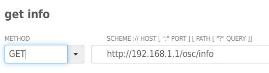

You will see the response below.

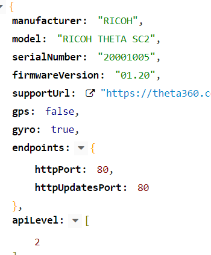

This is a test using Google Chrome.

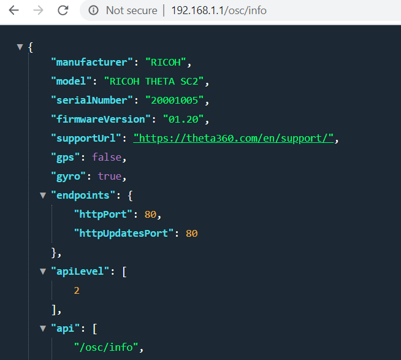

Chrome displays colored highlighting in my browser because I am using the free extension 
[JSON Awesome](https://chrome.google.com/webstore/detail/json-viewer-awesome/iemadiahhbebdklepanmkjenfdebfpfe?hl=en).

This is an example using curl on WSL on Windows 10.

Request

```bash
curl http://192.168.1.1/osc/info
```

Response

```json
{"manufacturer":"RICOH","model":"RICOH THETA SC2","serialNumber":"20001005","firmwareVersion":"01.64","supportUrl":"https://theta360.com/en/support/","gps":false,"gyro":true,"endpoints":{"httpPort":80,"httpUpdatesPort":80},"apiLevel":[2],"api":["/osc/info","/osc/state","/osc/checkForUpdates","/osc/commands/execute","/osc/commands/status"],"uptime":2949,"_wlanMacAddress":"58:38:79:2b:ad:c5","_bluetoothMacAddress":"6c:21:a2:47:d9:05"}
```

The rest of this tutorial will focus on POST commands.  You will need to use an API testing tool.

## state

The simplest POST command is 
[state](https://api.ricoh/docs/theta-web-api-v2.1/protocols/state/). Make sure that you use POST and not GET. Note that the header should include `Content-Type: application/json`. You need the HTTP header for most of the THETA SC2 POST commands. It's a good practice to include it.

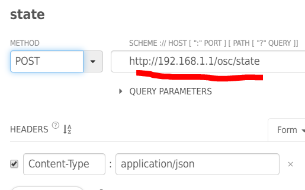

The response is below. You can see that we're able to grab lots of useful info from the state, including the battery level, and the last picture taken `_latestFileUrl`. 
My battery is at 66%. I need to charge it.

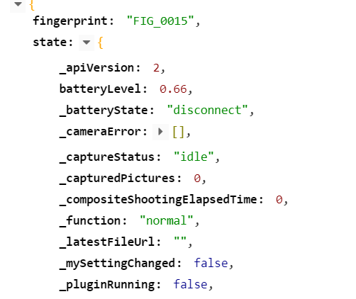

## takePicture

Finally, we get to the exciting part of our journey. 
We have a camera. Let's take a picture. It's time.  :-)

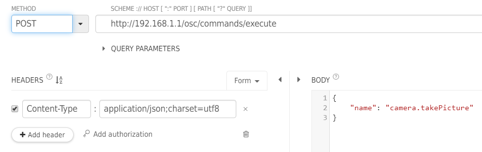

Closeup of endpoint.

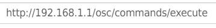

Closeup of the payload.

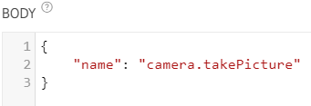

### Celebrate the Camera Chirp

The camera will now chirp when the take picture command is run. Developers like the chirp because it's associated with a successful outcome of your program. In the future, you can trigger the picture with object recognition or external sensors. However, for now, take a moment to celebrate the chirp.

### Response from takePicture

Disappointingly, we can't see the picture directly in the takePicture response. We're close, so just hang on for the next step. For now, pay attention to state value that you get in the response. Notice that it says, "inProgress."  This is important because you'll next need to check to make sure the camera has finished processing the image before you can download it.

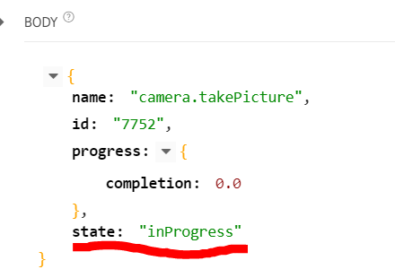

## View Image During API Testing

Repeat the POST example for `/osc/state` explained earlier in the 
document. As you've just taken a picture, your response will 
now show the `_latestFileUrl`. 
Use that to grab the file. You can open it in a browser. 
Pay attention to the `_captureStatus` value. You need to check
the status before you can download the file.

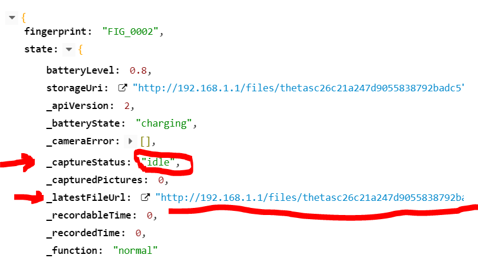

In the example below, I am using an API testing tool to get the image. 
However, you can also test this in a web browser. 
The file is in equirectangular JPEG format.

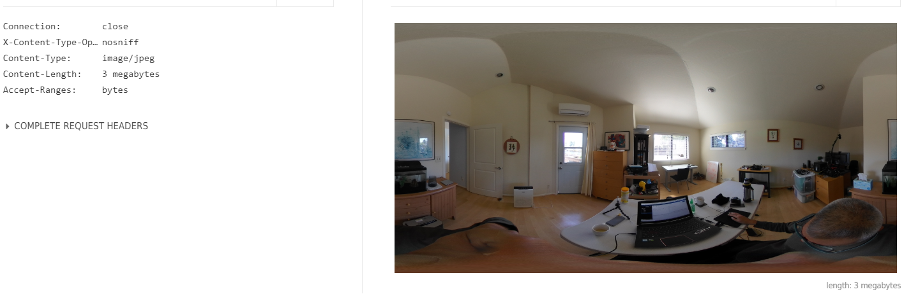
