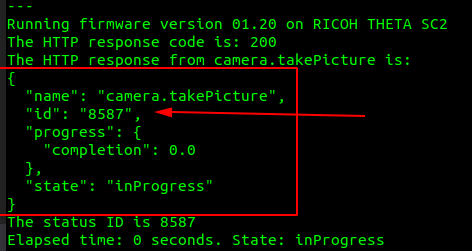
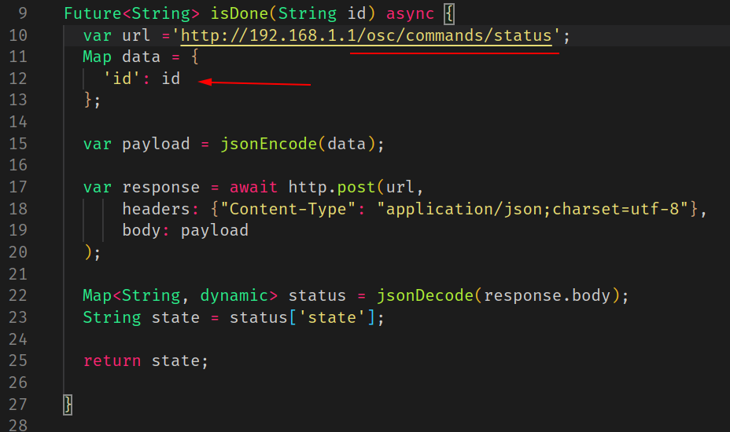
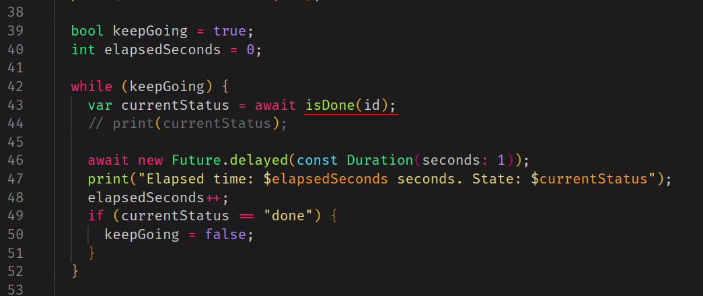
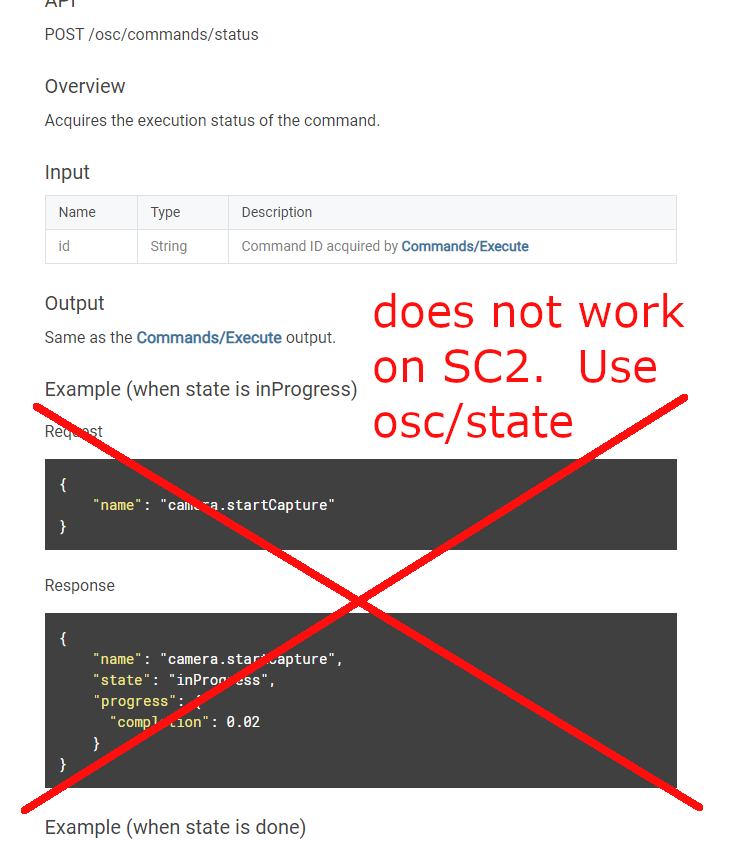

# Check Camera Status Before Sending Next Command

The SC2 appears to take quite a bit longer to be ready for the next picture shoot. The V/Z1 is faster in my experience. When you write your own program you should verify that the camera
is ready for the next command with `state` or `status`.

Although both `state` and `status` will work for 
`takePicture` in still image mode, you will need to 
use `state` if you use more advanced shots that require `startCapture`.

## Check camera availability with state

The flow of your program will be as follows:

    <--- camera.takePicture

    ----> response

    <--- POST /osc/state

    ----> response _captureStatus: shooting

    <--- POST /osc/state

    ----> response _captureStatus: shooting

    <--- POST /osc/state

    ----> response _captureStatus: shooting

    <--- POST /osc/state

    ----> response _captureStatus: shooting

    <--- POST /osc/state

    ----> response _captureStatus: idle

    <--- GET URL *URL = _LatestFileUrl of the state received immediately before

## Check camera availability with status

I used a network protocol analyzer log from both the RICOH mobile SDK and the official mobile app to see how these apps check for the readiness of the image to be download.  Both apps are using status. 

Using status, the steps are:

1. takePicture

2. check on status of takePicture using the state property.

3. if status shows state as inProgress, repeat check

4. If the status shows state as done, get the URL of the laste image taken

5. download file and save to disk.

To use status, you must get the `id` of the `/osc/command` from the HTTP response of `takePicture`.

Once you have the `id`, you can pass it to `status`.

Put the check on the status in a loop with a delay in the loop to avoid overwhelming the camera and your logs.  

Here's an example of putting a delay of 1 second into the loop.

## Checking Status of startCapture

Community member timbit123 identified a problem using [/osc/commands/status](https://api.ricoh/docs/theta-web-api-v2.1/protocols/commands_status/) to check the completion of start capture.  

See his post [here](https://community.theta360.guide/t/sc2-auto-bracket-options-not-ending/5651/2?u=craig).

