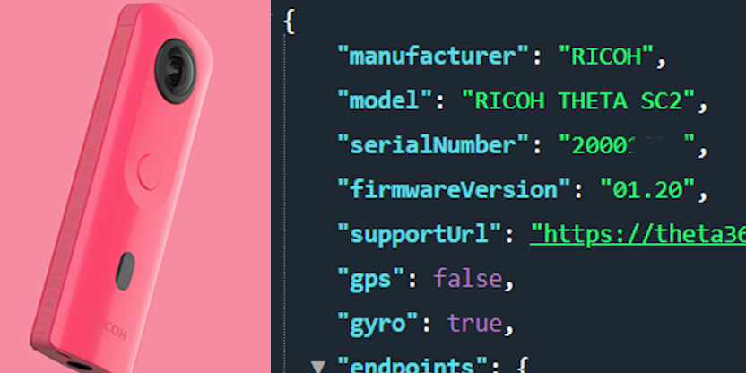
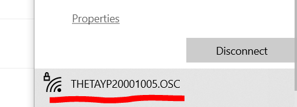
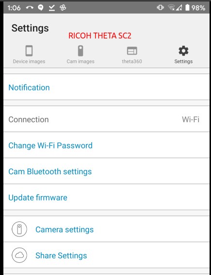
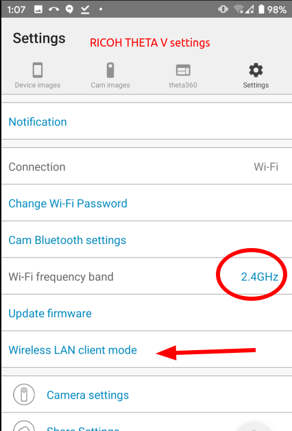

# RICOH THETA SC2 API

Build Android iOS mobile apps for the SC2 and connect 
your mobile app to the camera with Wi-Fi using this API.

## Overview

The RICOH THETA SC2 is a great, lightweight camera that takes good-looking 360° pictures. Many people in the developer community have asked about building applications for the SC2. Although the SC2 camera appears to conform to the RICOH THETA Wi-Fi API, it is not listed on 
[the official RICOH API site](https://api.ricoh/docs/theta-web-api-v2.1/) which we all use as our reference. Some developers have [reported problems](https://community.theta360.guide/t/question-about-getlivepreview-by-thetasc2-on-android/5117) with the SC2 and the 
[RICOH THETA SDK](https://www2.theta360.guide/doc/article/3) for features such as live preview. Other people have 
[reported problems using the SC2 with the Google Streetview mobile app](https://community.theta360.guide/t/theta-sc2-crash-street-view-app/5288?u=craig).

Camera support note: All models except m15 work with the API.  However, there are minor differences between each model.  This test is for the SC2. One important point about the SC2 is that it is using a slower MCU compared to the RICOH THETA V and Z1.  The slower speed of the SC2 results in longer processing times for all API commands.  This can cause problems if you run multiple API commands in sequence and do not check for completion of each command.  There are extensive examples in this document and sample code that show how to use 
[POST /osc/commands/status](https://api.ricoh/docs/theta-web-api-v2.1/protocols/commands_status/) to verify that your previous API command is finished processing.

This article organizes usage of the SC2 Wi-Fi API based on community testing.  It is not an official RICOH 
document. Please contact RICOH for official information.

## HTTP API Testing Tools

I am using THETA SC2 firmware 1.20 on a Windows 10 machine using the free API testing tool 
[Talend API Tester](https://chrome.google.com/webstore/detail/talend-api-tester-free-ed/aejoelaoggembcahagimdiliamlcdmfm?hl=en). This API testing tool is similar to 
[Postman](https://www.postman.com/). Another command line alternative is 
[curl](https://curl.haxx.se/). If you prefer to write scripts for your tests, I find it easy and effective to use [Python requests](https://requests.readthedocs.io/en/master/) or any number of JavaScript libraries that can handle an HTTP request. This article makes extensive use of the Dart 
[http package](https://pub.dev/packages/http) for both GET and POST requests.

Dart was chosen for many tests as it almost as easy to use as Bash or Python for command line scripts and provides a smooth and easy way to test mobile apps on iOS and Android with 
[Flutter](https://flutter.dev/).

## Connect Your Computer to the SC2

Turn the SC2 on and put it into Wi-Fi mode.

You must connect your workstation to the SC2 with Wi-Fi. The hotspot password is the serial number (just the numerical digits). 

On Windows, click on the Wi-Fi icon in the lower-right of your screen. Select the THETAYP hotspot.  

In this example, the password is 20001005. There are no letters or dots in the default password.

Once connected, the Wi-Fi icon on the front of the SC2 will be solid. If the Wi-Fi icon is still flashing, the camera is not connected.

## Troubleshooting Connection

The THETA SC2 Wi-Fi only functions at 2.4GHz. The THETA V and the Z1 operate at both 2.4GHz and 5GHz. If you have an unstable Wi-Fi connection with the SC, try a different Wi-Fi dongle or laptop to isolate the problem.

If you are working with multiple devices, make sure you are connecting to the correct camera.  

Put the camera right next to your development workstation. Moving the camera 5 feet away can make a difference.

Turn off other Wi-Fi routers in the test area that may be causing Wi-Fi interference.

If you have two network interfaces in your development workstation, make sure that your primary router is not at 192.168.1.1. The THETA SC2 will always be 192.168.1.1 in Access Point (AP) mode. 

## Connection Limitations Compared to THETA V and Z1

* SC2 only operates at 2.4GHz.  The V and Z1 can also connect at 5GHz
* SC2 can only operation in Access Point (AP) mode.  The V and Z1 can also operate in Client Mode (CL)

You can use the official RICOH mobile app to check camera features.

Compare the available SC2 settings in the image above to the THETA V settings in the 
image below.

