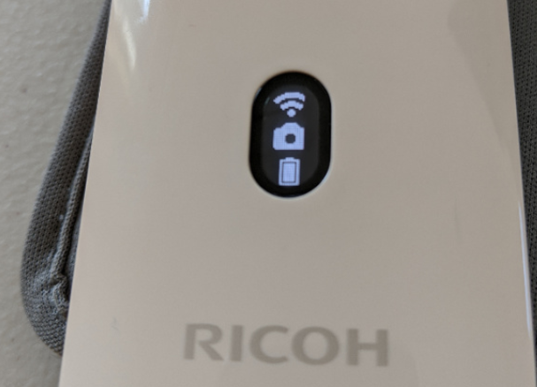

# RICOH THETA API

Build Android iOS mobile apps for the RICOH THETA cameras.
Connect 
your mobile app to the camera with Wi-Fi.

## Overview

As of December 6, 2021, there are two RICOH THETA camera models in production, the
[RICOH THETA Z1 51GB](https://theta360.com/en/about/theta/z1.html), available for $1050, and the
[RICOH THETA SC2](https://theta360.com/en/about/theta/sc2.html), available for $300.

The older Z1 (without the 51GB designation) is identical to the 51GB model except for the storage capacity.  Both
Z1 versions use the same firmware.

The [RICOH THETA SC2 Business Edition](https://us.ricoh-imaging.com/product/theta-sc2-b2b/) is almost the same as the SC2.  It has these differences:

* firmware numbering is different
* SC2B has ROOM preset mode with a room icon on the OLED.  ROOM preset appears
to be identical to HDR on the SC2.  However, there is no icon on the SC2 OLED to
indicate that the camera is in HDR mode and no easy way to toggle between
HDR and non-HDR modes.  The SC2B can change presets with a button on the camera.
* serial number scheme is different
* SC2B comes only in a business grey.  SC2 does not come in business grey.
* SC2B has time shift mode which can be used to eliminate the photographer from the
picture.  There is no way to duplicate this function on the SC2.  You will need to
use Photoshop or equivalent to merge two separate pictures manually or use your
own software.

The Z1 is a better camera and should be used for business applications.
However, as the price difference may impact business models, some developers
are using the SC2 in business applications. 

The RICOH THETA SC2 is a great, lightweight consumer camera that takes good-looking 360° pictures. Many people in the developer community have asked about building applications for the SC2. Although the SC2 camera appears to conform to the RICOH THETA Wi-Fi API, it is not listed on 
[the official RICOH API site](https://api.ricoh/docs/theta-web-api-v2.1/) which we all use as our reference. Some developers have [reported problems](https://community.theta360.guide/t/question-about-getlivepreview-by-thetasc2-on-android/5117) with the SC2 and the 
[RICOH THETA SDK](https://www2.theta360.guide/doc/article/3) for features such as live preview.

The SC2 uses a slower MCU than the RICOH THETA V and Z1.  The slower speed of the SC2 results in longer processing times for all API commands.  This can cause problems if you run multiple API commands in sequence and do not check for completion of each command.  There are extensive examples in this document and sample code that show how to use 
[POST /osc/commands/status](https://api.ricoh/docs/theta-web-api-v2.1/protocols/commands_status/) and [POST /osc/state](https://api.ricoh/docs/theta-web-api-v2.1/protocols/state/) 
to verify that your previous API command is finished processing.  Refer to
the section on [SC2 API Differences](differences/) for a short overview of
SC2 differences with `commands/status` when using `startCapture`. 

This article organizes usage of the SC2 Wi-Fi API based on community testing.  It is not an official RICOH 
document. Please contact RICOH for official information.

## HTTP API Testing Tools

I am using THETA SC2 firmware 1.64 on a Windows 10 machine. There
are many API testing tools you can use. Examples:  
[Postman](https://www.postman.com/), [JMeter](https://jmeter.apache.org/download_jmeter.cgi) and [Insomnia](https://insomnia.rest/). Another command line alternative is 
[curl](https://curl.haxx.se/). If you prefer to write scripts for your tests, I find it easy and effective to use [Python requests](https://requests.readthedocs.io/en/master/) or any number of JavaScript libraries that can handle an HTTP request. This article makes extensive use of the Dart 
[http package](https://pub.dev/packages/http) for both GET and POST requests.

Dart was chosen for many tests as it almost as easy to use as Bash or Python for command line scripts and provides a smooth and easy way to test mobile apps on iOS and Android with 
[Flutter](https://flutter.dev/).

Several of the tests are in the [Oppkey THETA API Test Kit (ATK)](https://oppkey.github.io/oppkey_theta_atk/).

## Connect Your Computer to the RICOH THETA

Turn the RICOH THETA on and put it into Wi-Fi AP mode.  
The SC2 can only function in AP mode. Although the Z1 can connect
in Client Mode, this document focuses on AP mode.  To use
Client Mode, you should use digest authentication. See 
the [community discussion for more information on developing
client mode applications](https://community.theta360.guide/t/tip-developing-theta-client-mode-applications/2450?u=craig). 

You must connect your workstation to the SC2 with Wi-Fi. The hotspot password is the serial number (just the numerical digits). 

On Windows, click on the Wi-Fi icon in the lower-right of your screen. Select the THETAYP hotspot.  

In this example, the password is 20001005. There are no letters or dots in the default password.

Once connected, the Wi-Fi icon on the front of the SC2 will be solid. If the Wi-Fi icon is still flashing, the camera is not connected.

## Troubleshooting Connection

The THETA SC2 Wi-Fi only functions at 2.4GHz. The THETA V and the Z1 operate at both 2.4GHz and 5GHz. If you have an unstable Wi-Fi connection with the SC2, try a different Wi-Fi dongle or laptop to isolate the problem.

If you are working with multiple devices, make sure you are connecting to the correct camera.  

Put the camera right next to your development workstation. Moving the camera 5 feet away can make a difference.

Turn off other Wi-Fi routers in the test area that may be causing Wi-Fi interference.

If you have two network interfaces in your development workstation, make sure that your primary router is not at 192.168.1.1. The THETA SC2 will always be 192.168.1.1 in Access Point (AP) mode.

Do not use the Windows 10 network PIN.  Use the security key.

Below the PIN input field, there is a link that says, 
_Connect using a security key instead_.

## Connection Limitations Compared to THETA V and Z1

* SC2 only operates at 2.4GHz.  The V and Z1 can also connect at 5GHz
* SC2 can only operate in Access Point (AP) mode.  The V and Z1 can also operate in Client Mode (CL)

You can use the official RICOH mobile app to check camera features.

Compare the available SC2 settings in the image above to the THETA V settings in the 
image below.

