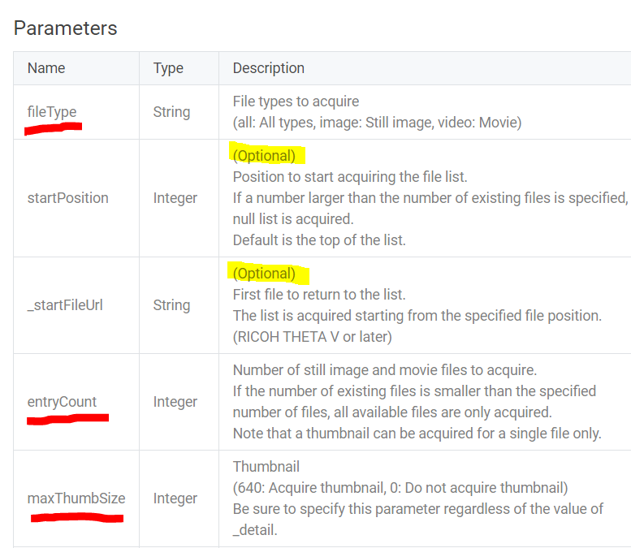
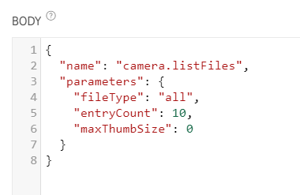
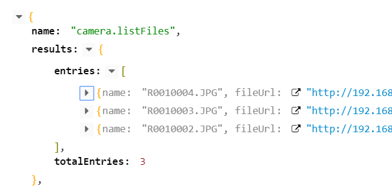
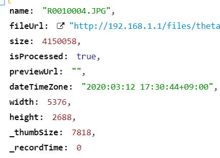

# Listing Files

First, great job on taking a picture and downloading it to your computer with a GET command. Now, let's tackle a slightly more complex POST request with parameters in the payload. We'll list the files. Look at the API below and identify which parameters are optional and which are required.

[camera.listFiles](https://api.ricoh/docs/theta-web-api-v2.1/commands/camera.list_files/)

Let's focus on the required parameters. I've underlined the "required" parameters in red.

## Structuring the Request

In the example below, all the parameters to the left of the colon are enclosed in quotes. For example, use "fileType", not fileType. To the right of the colon, the numbers are not enclosed in quotes. Use 10 not "10".

## Getting the Response

This is a collapsed view of the response. I only have 3 images on my THETA SC at the moment.

Expanding an entry in the array, you can see the useful data you're getting back.

NOTE: Thumbnails do not work on the SC2 listFiles command as of July 9, 2020.
See [this](https://community.theta360.guide/t/sc2-listfiles-command-with-thumbnails-not-working/5748?u=craig) community discussion.