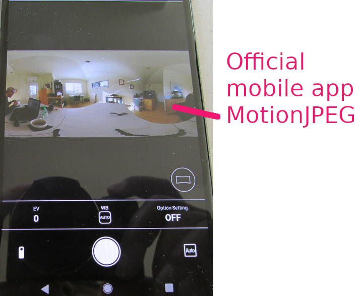
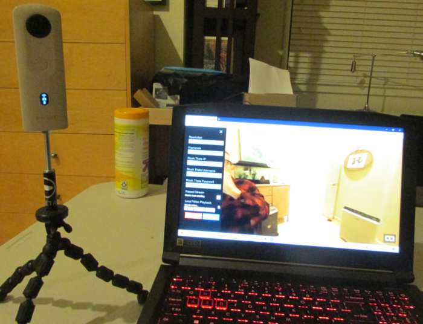
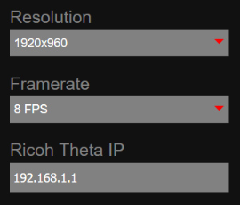

# LivePreview - MotionJPEG Live Stream

There are many problems and workarounds using 
[getLivePreview](https://api.ricoh/docs/theta-web-api-v2.1/commands/camera.get_live_preview/) with the SC2. Refer to
the problem section of this document.

## Using getLivePreview in mobile apps

We know that getLivePreview from the SC2 does work.
On the official RICOH mobile app, there is a live preview of the scene before a picture is taken.

Unfortunately, getLivePreview does not work smoothly in the SDK.
You can get through some of the problems by calling getLivePreview frequently.
The stream on the SC2 does stop in the SDK, but you can restart with a new
getLivePreview.

## getLivePreview in web-based applications

getLivePreview also works with third-party applications.

Amelia Viewer for RICOH THETA by 
Jake Kenin. [GitHub repository](https://github.com/codetricity/amelia_viewer).

The stream worked without any problems.  In Firefox, I'm 
using [A-Frame](https://aframe.io/) to handle the navigation in a normal 360 view.

Pre-compiled binaries for Windows 10 and Linux 
are [here](https://github.com/codetricity/amelia_viewer/releases).

I am using a stream of 1920x960 by 8 FPS.

Binary data of live view (MotionJPEG).
Binary data is transferred as Content-Type: multipart/x-mixed-replace.

Main code example is [here](http://%20https//github.com/codetricity/amelia_viewer/blob/master/assets/js/ricoh_api.js):

Function for get live preview is [here](https://github.com/codetricity/amelia_viewer/blob/3b9c74a6861f3a72cd4951397a77f705da6ac664/assets/js/ricoh_api.js#L218):

A stripped down example of displaying the MotionJPEG stream is [here](https://github.com/aruntj/mjpeg-readable-stream/blob/master/index.html).

Another excellent source of information on MotionJPEG 
is [this](https://community.theta360.guide/t/extended-livepreview-sample-code-for-theta-plug-in-with-webui/5272?u=craig) plug-in from the skunkworks club.

Note that the THETA SC2 cannot use plug-in technology.  However, other parts of the article are relevant.

