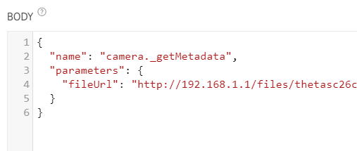
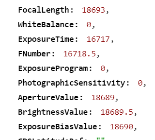

# Image Metadata

At this stage, you may want to just download all the images and process all the images on the mobile device or in your cloud. 

You can grab the image metadata on your Android mobile phone with 
[Android ExifInterface](https://developer.android.com/reference/android/media/ExifInterface).

Most developers grab all the images and process the data on the device. 
However, if there are hundreds or thousands of images on the camera, you may want to pull some data from images prior to processing.

Unfortunately, [_getMetadata](https://api.ricoh/docs/theta-web-api-v2.1/commands/camera._get_metadata/) does 
not work correctly on the SC2 as of July 10, 2020.
You should Run the test yourself for each property you want to use to make sure
that the camera is providing your app with the correct data.

Request

Response

