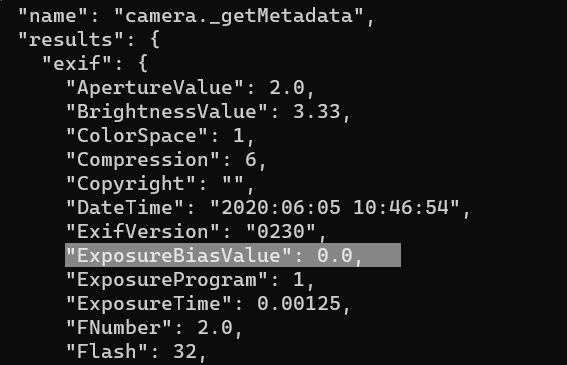
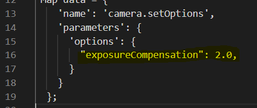
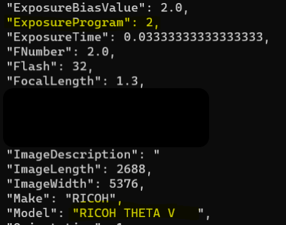
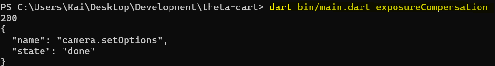
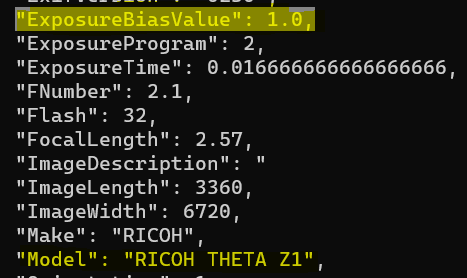

# Image Metadata

At this stage, you may want to just download all the images and process all the images on the mobile device or in your cloud. 

You can grab the image metadata on your Android mobile phone with 
[Android ExifInterface](https://developer.android.com/reference/android/media/ExifInterface).

Most developers grab all the images and process the data on the device. 
However, if there are hundreds or thousands of images on the camera, you may want to pull some data from images prior to processing.

## Problems with SC2

Unfortunately, [_getMetadata](https://api.ricoh/docs/theta-web-api-v2.1/commands/camera._get_metadata/) does 
not work correctly on the SC2 as of July 10, 2020.
You should Run the test yourself for each property you want to use to make sure
that the camera is providing your app with the correct data.

Request


Response


## Community Tests

### exposure values with SC2

Key takeaways:

* The RICOH API for the SC2 has a few issues. The `getMetadata` call does not return the correct image exposure data.
  * Correct exposure is saved to the file metadata and can be checked with ExifTool
* The RICOH API for the THETA V works fine. The `getMetadata` call returns the correct image exposure data
 
Using a THETA SC2 (Firmware Version: 01.31), I adjusted the exposure to -0.3EV from the mobile app and took a picture.


Ran [getMetadata](https://api.ricoh/docs/theta-web-api-v2.1/commands/camera._get_metadata/) using the camera API.
 
Code snippet is below.

```dart
var url ='http://192.168.1.1/osc/commands/execute';

Map data = {
    'name': 'camera.setOptions',
    'parameters': {
      'options': {
        "exposureCompensation": 2.0,
      }
    }
  };
```


The API returned an ExposureBialsValue of `NULL`. Also note that the `Model` and `Software` values are missing.


Using [ExifTool](https://exiftool.org/) I was able to look at the 
metadata from the raw image file 

I found that the raw image contained the correct exposure metadata of -0.3.


The takeaway is that the SC2 API has some issues. It does not return the correct image exposure metadata information. However, the correct metadata is stored in the image file. 

### exposure values with THETA V

Firmware Version: 3.30.1, [getMetadata](https://api.ricoh/docs/theta-web-api-v2.1/commands/camera._get_metadata/)

 
Initially, the ExposureBiasValue is set to zero.



I adjusted the Exposure value to 1.3 from the official mobile app.


I used the API to make sure that the value was consistent. Success!


Using the API, I changed the ExposureBiasValue with the API to 2.



I looked at the metadata with the API. ExposureBiasValue = 2. Success!



### exposure values with THETA Z1

I set the exposure compensation to 1.0 using the RICOH API sample
code for this tutorial.  



After taking a picture I received the metadata using the RICOH API 
call `getMetadata`

The exposure value was 1.0. Success!


