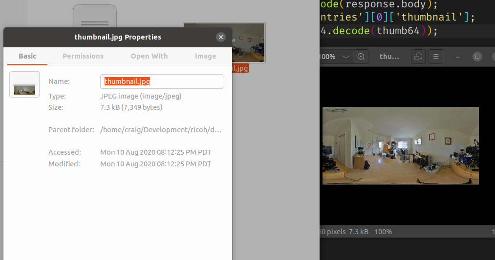

# SC2 Problem Quick Summary

## LivePreview Randomly Stops in SDK

__Problem Description__: livePreview screen goes black in SC2.
With the Android SDK,
you get an
EOFException in readMJpegFrame() in MJpegInputStream.

__Workaround__: [Submitted by tamy](https://community.theta360.guide/t/question-about-getlivepreview-by-thetasc2-on-android/5117/15?u=craig).
Call camera.getLivePreview again after the error occurs.

## LivePreview Stops After Running a Command

__Problem Description__: livePreview stops after certain commands.

__Workaround__: Certain API commands appear to stop the live preview.  If the screen is 
stopping, run camera.getLivePreview again.

## startCapture always shows inProgress

Problem and solution [reported by timbit123](https://community.theta360.guide/t/solved-check-for-sc2-auto-bracket-completion/5651/2?u=craig).

__Problem Description__: When using /osc/command/status with the id from
`startCapture`, the state is always inProgress.

__Workaround__: Use `/osc/state` and wait for `_captureStatus` to go back to `idle`.

## listFiles does not show thumbnails and freezes SC2

[Problem reported by timbit123](https://community.theta360.guide/t/sc2-listfiles-command-with-thumbnails-not-working/5748?u=craig).

__Problem Description__: `maxThumbSize: 640` does not show the thumbnails.
The SC2 will freeze. There is no way to get the thumbnails. The
listFiles command on the SC2 works differently than it does on the V and Z1.

__Workaround__: There are a few workarounds to get the base64 encoded 
thumbnail of approximately 7.3kB in size.  However, as the workaround is not 
documented and may change, please contact jcasman@oppkey.com and ask for
the most recent workaround.  As of August 11, 2020, we have thumbnails 
working with the SC2.

Code sample is available that saves thumbnails to local storage to help with
testing.

## camera._getMetadata not working as expected

__Problem Description__: Properties such as ExposureBiasValue
are incorrect.  

__Workaround__: The correct metadata appears to be in the image file.
Pull the actual image to your mobile phone and then use a library
to extract the metadata in the image on your mobile phone.  Do not
use camera._getMetadata to pull the information if you suspect 
it is not providing you with the correct values.

## previewFormat width and height not working

__Problem Description__: with getOptions, the `previewFormat` does 
not show correct values.  `width` and `height` return 0.

__Workaround__: There is no known workaround to set the width and 
height, but getLivePreview does appear to work.