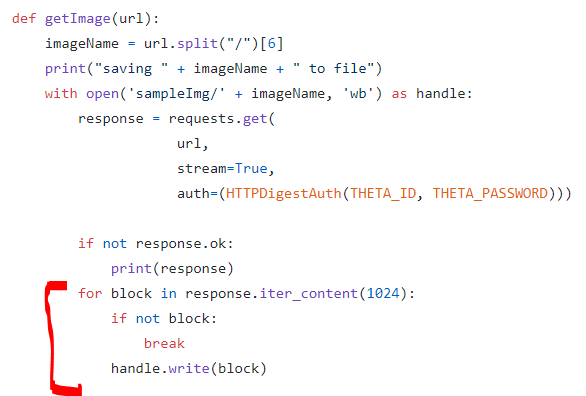

# Save Image

Here's an example of getting the 
`_latestFileUrl` from `/osc/state` and writing the bytes with the Dart `File.writeAsBytes` method.

Most languages such as Java, Python, JavaScript have libraries to save a file stream from a URL to permanent local storage. In Python, it is just a few lines. When you make the GET request, your HTTP library may require you to specify  that the response is a stream. When you save the THETA image, you may need a loop to save the file as a set of blocks. An example for Python is below. Saving a file from an HTTP stream is a common operation with most languages, so just search for examples on Google or StackOverflow for your specific programming language.

